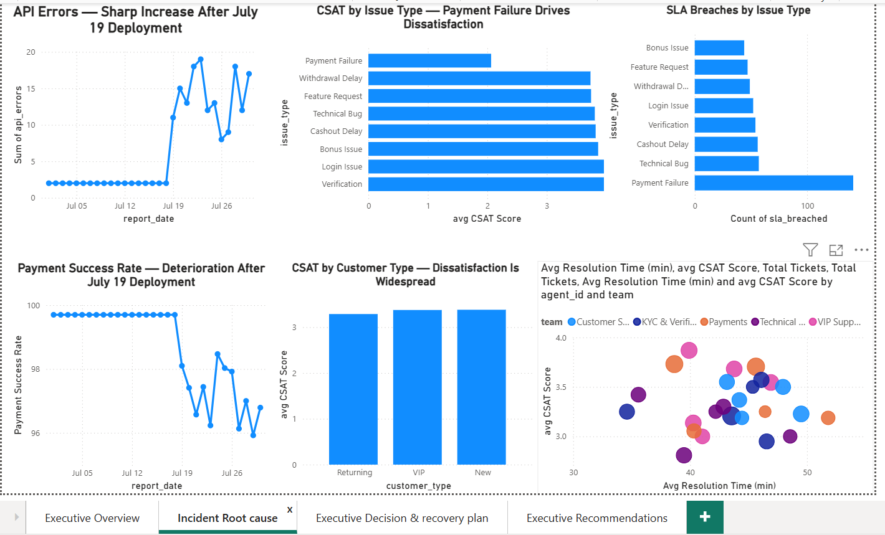

# Customer Experience Incident Analysis

> **Operations Intelligence case study using SQL and Power BI to investigate a CSAT decline, identify the strongest incident drivers, and determine whether permanent workforce expansion was justified.**


---

## Executive Summary

This project investigates a significant decline in customer satisfaction and evaluates whether the deterioration was primarily driven by workforce capacity, operational performance, or a technical/payment-service incident.

The analysis combines customer support, engineering, workforce, QA, and marketing data to move from **KPI reporting to root-cause analysis and executive decision support**.

### The key conclusion

The evidence strongly indicates that the **July 19 operational event and subsequent payment/API degradation were the most likely drivers of the customer-experience deterioration**.

Payment Failure emerged as the highest-impact customer issue, while workload alone did not sufficiently explain the decline in CSAT.

Therefore, the recommended management decision was:

> **Stabilize the underlying payment/API issue before committing to permanent workforce expansion, then reassess sustainable capacity using post-incident demand and performance.**

---

# Business Problem

Management needed answers to seven questions:

1. What is driving the CSAT decline?
2. Is increasing workload overwhelming the support organization?
3. Which issue types are creating the greatest customer impact?
4. Is there evidence of a technical or payment-service incident?
5. Are specific teams, agents, or customer groups disproportionately affected?
6. Does the organization need additional permanent headcount?
7. What actions should management take immediately?

The objective was not simply to report KPIs, but to determine the strongest evidence behind the deterioration and translate that evidence into an operational decision.

---

# Executive KPI Baseline

| KPI | Result |
|---|---:|
| Total Tickets | **500** |
| Average CSAT | **3.35** |
| FCR | **38%** |
| SLA Breach Rate | **13%** |
| Average Resolution Time | **43.39 min** |
| Average Payment Success | **98.69%** |

These metrics established the overall operating baseline before deeper investigation.

---

# Key Findings

## 1. CSAT declined sharply around July 19

The CSAT trend showed a significant deterioration around the July 19 incident boundary:

| Date | CSAT |
|---|---:|
| July 16 | 3.88 |
| July 17 | 4.21 |
| July 18 | 3.69 |
| July 19 | 3.13 |
| July 20 | 2.42 |

The timing was significant because the CSAT deterioration occurred alongside deterioration in engineering and payment metrics.

**Important analytical distinction:** temporal association does not by itself prove causation. Definitive attribution would require timestamped deployment, application, and payment-provider logs.

---

## 2. Engineering health deteriorated after July 19

Engineering data showed a substantial increase in API errors around the July 19 event.

Before the event:

- API errors were approximately **2 per day**
- Payment success was approximately **99.70%**

Around and after July 19:

- API errors increased significantly
- Payment success deteriorated
- Technical degradation persisted beyond the initial event

This closely aligned with the deterioration observed in customer-support outcomes.

---

## 3. Payment Failure was the highest-impact customer issue

Payment Failure emerged as the strongest customer-impacting issue.

It recorded approximately:

- **2.06 average CSAT**
- **64 SLA breaches**
- **128 repeat contacts**

This made Payment Failure the highest-priority operational issue from a customer-experience perspective.

---

## 4. Customer dissatisfaction was widespread

The CSAT problem was not isolated to one customer segment.

New, returning, and VIP customers all experienced dissatisfaction.

This weakened the hypothesis that the decline was primarily caused by a change in customer acquisition or a single marketing audience.

---

## 5. Workload alone did not explain the CSAT decline

The analysis compared ticket volume, resolution time, team performance, and customer satisfaction.

High workload did not consistently correspond with poor CSAT.

This suggested that simply adding headcount would not necessarily resolve the underlying customer-experience problem.

The evidence therefore supported **technical/payment stabilization before permanent recruitment**.

---

# Root Cause Assessment

### Primary hypothesis

**Technical/payment-service degradation associated with the July 19 operational event.**

### Supporting evidence

- CSAT declined sharply around the incident boundary
- API errors increased significantly
- Payment success deteriorated
- Payment Failure had the lowest CSAT
- Payment Failure generated the highest SLA-breach impact
- Payment Failure generated substantial repeat contact
- Dissatisfaction affected multiple customer types
- Workload alone did not explain the deterioration

### Confidence

**Strong evidence of temporal and operational association, but not definitive causation.**

To establish causality, additional evidence would be required, including:

- Exact deployment timestamp
- First application/API error timestamp
- First payment failure timestamp
- Payment-provider or aggregator status
- API response/error codes
- Application workflow logs
- Customer ticket timestamps
- CSAT response timestamps

---

# Workforce Decision

## Decision: Do not approve permanent workforce expansion immediately.

The available evidence did not justify treating the incident as a permanent staffing problem.

The recommended response was:

1. Stabilize the payment/API environment
2. Rebalance capacity toward high-impact Payment Failure tickets
3. Use controlled overtime where necessary
4. Provide targeted QA coaching
5. Monitor post-fix performance
6. Recalculate sustainable staffing requirements after stabilization

### Why?

Incident-period resolution time and workload may be temporarily inflated.

Hiring against a temporary incident spike creates a risk of **permanent staffing cost for a temporary problem**.

---

# Recruitment Triggers

Permanent recruitment should be reconsidered if, after technical stabilization:

- Ticket demand remains at least **15% above baseline**
- Team utilization remains consistently above approximately **85%**
- SLA performance remains below the required service level
- Sustained overtime continues
- Demand forecasts show a continuing capacity gap
- Post-incident resolution time remains elevated
- The capacity gap persists for approximately **14 days or longer**

The objective is to distinguish a **temporary incident-driven workload spike** from a **structural workforce capacity problem**.

---

# Recommended Executive Actions

### Engineering / Product

- Investigate the July 19 deployment
- Review payment/API error patterns
- Validate payment-provider and aggregator performance
- Confirm the exact sequence of technical failures

### Operations

- Prioritize Payment Failure tickets
- Rebalance available capacity toward high-impact queues
- Use controlled overtime where necessary
- Monitor SLA and repeat contacts closely

### Quality Assurance

- Provide targeted coaching on payment-related interactions
- Protect solution quality while improving resolution speed
- Monitor CSAT, FCR, SLA and resolution time

### Marketing

- Avoid major acquisition expansion while payment reliability remains unstable
- Reassess acquisition activity after service performance stabilizes

---

# Recovery Gate

Before returning to normal operating conditions, management should target:

### Payment Success ≥ 99.5% for 48 consecutive hours

Alongside improvement in:

- CSAT
- FCR
- SLA performance
- Repeat contacts
- Resolution time
- Payment Failure volume
- API error levels

The recovery decision should be based on multiple indicators rather than payment success alone.

---

# Power BI Dashboard

The dashboard was designed around three executive questions:

### 1. What is happening?

**Executive Overview**


---

### 2. Why is it happening?

**Incident Root Cause**



---

### 3. What should management do?

**Executive Recommendations**


---

# Analytical Workflow

```text
Raw Operational Data
        ↓
Data Exploration & Validation
        ↓
KPI Analysis
        ↓
Trend & Segmentation Analysis
        ↓
Root Cause Investigation
        ↓
Workforce Capacity Assessment
        ↓
Power BI Executive Dashboard
        ↓
Management Recommendation
