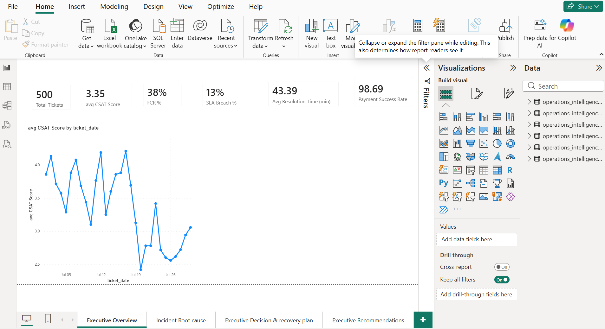
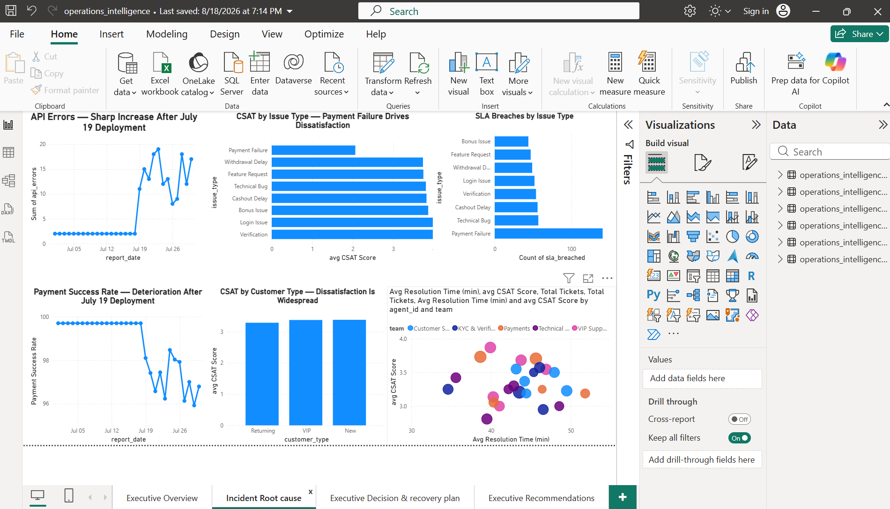
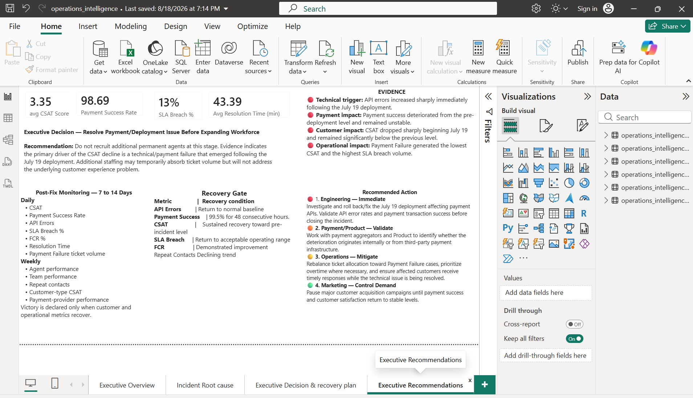

# Customer Experience Incident Analysis

## Operations Intelligence Case Study

**Author:** Winston Nkwo  
**Tools:** MySQL, SQL, Power BI, DAX, Excel  
**Focus:** Customer Experience, Root Cause Analysis, Operational Performance, Workforce Planning

---

## 1. Executive Summary

This project investigates a significant decline in customer satisfaction and evaluates whether the deterioration was primarily driven by workforce capacity, operational performance, or a technical/payment-service incident.

The analysis combines customer support tickets, agent performance, engineering health, workforce data, QA scores, and marketing activity.

The evidence identified a strong temporal association between the July 19 operational event, increased API errors, declining payment success, and a sharp deterioration in CSAT.

The analysis also found that Payment Failure was the most significant customer-impacting issue, with the lowest CSAT, the highest number of SLA breaches, and a high level of repeat contact.

Based on the evidence available, the recommended management response was to stabilize the underlying technical/payment issue before committing to permanent workforce expansion.

---

# 2. Business Problem

Management needed to understand why customer satisfaction had deteriorated and whether the organization had a genuine workforce capacity problem.

The key business questions were:

1. What is driving the CSAT decline?
2. Is increasing workload overwhelming the support organization?
3. Which issue types are creating the greatest customer impact?
4. Is there evidence of a technical or payment-service incident?
5. Are specific teams, agents, or customer groups disproportionately affected?
6. Does the organization need additional permanent headcount?
7. What actions should management take immediately?

The objective was not simply to report KPIs, but to determine the most likely drivers of the deterioration and translate the findings into an operational decision.

---

# 3. Dataset

The analysis uses six related datasets.

| Dataset | Purpose |
|---|---|
| `tickets.csv` | Customer support interactions, CSAT, FCR, SLA, issue type, team and resolution time |
| `agents.csv` | Agent information and organizational attributes |
| `engineering.csv` | API errors and payment success performance |
| `workforce.csv` | Workforce and staffing information |
| `qa_scores.csv` | Quality assurance performance |
| `marketing.csv` | Marketing/customer acquisition activity |

The datasets were combined conceptually to investigate the incident from multiple operational perspectives rather than relying on a single KPI.

---

# 4. Analytical Approach

The investigation followed four stages:

### Stage 1 — Data Exploration

The data was inspected for:

- Table structure
- Record counts
- Date ranges
- Missing values
- Issue distribution
- Customer-type distribution
- Team distribution
- Agent workload

See:

[`01_data_exploration.sql`](../sql/01_data_exploration.sql)

### Stage 2 — KPI Analysis

Core operational KPIs were calculated:

- Total tickets
- Average CSAT
- First Contact Resolution
- SLA breach rate
- Average resolution time
- Payment success rate
- Repeat contacts
- Team and issue-level performance

See:

[`02_kpi_analysis.sql`](../sql/02_kpi_analysis.sql)

### Stage 3 — Root Cause Investigation

The investigation compared performance before and after the July 19 incident boundary and examined:

- CSAT trends
- API errors
- Payment success
- Issue-level customer impact
- SLA breaches
- Repeat contacts
- Customer type
- Team and agent performance

See:

[`03_root_cause_analysis.sql`](../sql/03_root_cause_analysis.sql)

### Stage 4 — Workforce Assessment

The final stage assessed:

- Workload hours
- Workload by team
- Agent workload
- FTE requirements
- Capacity scenarios
- Conditions for future recruitment

See:

[`04_workforce_analysis.sql`](../sql/04_workforce_analysis.sql)

---

# 5. Executive KPI Baseline

The overall dataset produced the following baseline:

| KPI | Result |
|---|---:|
| Total Tickets | 500 |
| Average CSAT | 3.35 |
| FCR | 38% |
| SLA Breach Rate | 13% |
| Average Resolution Time | 43.39 minutes |
| Average Payment Success | 98.69% |

These metrics established the overall operating position before deeper investigation.

---

# 6. Key Finding 1 — CSAT Declined Sharply Around July 19

The CSAT trend showed a significant deterioration around the July 19 incident boundary.

The observed trend included:

- July 16: 3.88
- July 17: 4.21
- July 18: 3.69
- July 19: 3.13
- July 20: 2.42

The timing of the deterioration was significant because it occurred alongside deterioration in engineering and payment metrics.

However, temporal association alone does not prove causation.

Further timestamped deployment, application, and payment-provider logs would be required to establish definitive causality.

---

# 7. Key Finding 2 — Engineering Health Deteriorated After July 19

Engineering data showed a substantial increase in API errors around the July 19 event.

Before the incident boundary:

- API errors were approximately 2 per day.
- Payment success was approximately 99.70%.

Around and after July 19:

- API errors increased sharply.
- Payment success deteriorated.
- The technical degradation persisted beyond the initial event.

This pattern closely aligned with the customer-experience deterioration observed in the support data.

The evidence therefore strongly indicated that the technical/payment environment was a major contributor to the incident.

---

# 8. Key Finding 3 — Payment Failure Was the Highest-Impact Customer Issue

Payment Failure emerged as the most significant customer-impacting issue.

It showed:

- Average CSAT of approximately 2.06
- 64 SLA breaches
- 128 repeat contacts

This made Payment Failure the strongest operational priority from a customer-impact perspective.

The issue also provides a plausible connection between the engineering degradation and customer dissatisfaction because payment reliability directly affects the customer's ability to complete important transactions.

---

# 9. Key Finding 4 — Customer Dissatisfaction Was Widespread

The CSAT problem was not isolated to one customer segment.

New, returning, and VIP customers all experienced dissatisfaction.

This weakened the hypothesis that the CSAT decline was primarily caused by a change in customer acquisition or a single marketing audience.

The finding suggested that the underlying problem was broader and more closely related to the customer experience itself.

---

# 10. Key Finding 5 — Workload Alone Did Not Explain the CSAT Decline

The analysis compared ticket volume, resolution time, team performance, and customer satisfaction.

High workload did not consistently correspond with poor CSAT.

For example, VIP Support handled a relatively high ticket volume while maintaining stronger customer satisfaction than some lower-volume teams.

This suggested that simply adding headcount would not necessarily resolve the underlying customer-experience problem.

The evidence therefore supported investigating the technical/payment issue before treating recruitment as the primary solution.

---

# 11. Root Cause Assessment

### Primary hypothesis

**Technical/payment-service degradation associated with the July 19 incident.**

### Supporting evidence

1. CSAT declined sharply around the incident boundary.
2. API errors increased significantly.
3. Payment success deteriorated.
4. Payment Failure generated the lowest CSAT.
5. Payment Failure produced the highest SLA-breach impact.
6. Payment Failure generated substantial repeat contact.
7. Dissatisfaction affected multiple customer types.
8. Workload alone did not explain the customer-experience deterioration.

### Confidence level

**Strong evidence of temporal and operational association, but not definitive causation.**

To confirm causation, the following evidence would be required:

- Exact deployment timestamp
- First application/API error timestamp
- First payment failure timestamp
- Payment-provider or aggregator status
- API response/error codes
- Application workflow logs
- Customer ticket timestamps
- CSAT response timestamps

---

# 12. Workforce Assessment

The analysis calculated workload using:

**Workload Hours = Ticket Volume × Average Resolution Time / 60**

Required staffing was estimated using:

**Required FTE = Total Workload Hours / Productive Hours per Agent**

Productive hours should exclude:

- Breaks
- Meetings
- Training
- Leave
- Administrative work
- Other non-ticket activities

A critical consideration is that incident-period resolution time may be temporarily inflated.

Therefore, using the incident-period AHT/resolution time as the sole basis for permanent recruitment could result in overstaffing after the technical issue is resolved.

---

# 13. Recruitment Decision

### Decision: Do not approve permanent workforce expansion immediately.

The evidence available at the time did not justify immediate permanent hiring.

Instead, management should:

1. Stabilize the payment/API environment.
2. Temporarily rebalance high-impact Payment Failure work.
3. Use controlled overtime only where necessary.
4. Provide targeted QA coaching.
5. Monitor post-fix customer and operational metrics.
6. Recalculate sustainable staffing requirements after stabilization.

---

# 14. Recommended Recruitment Triggers

Permanent recruitment should be reconsidered if the following conditions persist after the technical issue has been resolved:

- Ticket demand remains at least 15% above baseline.
- Team utilization remains consistently above approximately 85%.
- SLA performance remains below the required service level.
- Sustained overtime continues.
- Demand forecasts indicate a continuing capacity gap.
- Post-incident resolution time remains elevated.
- The capacity gap persists for approximately 14 days or longer.

The objective is to distinguish a **temporary incident-driven workload spike** from a **structural workforce capacity problem**.

---

# 15. Executive Recommendations

### Immediate

**Engineering / Product**

- Investigate the July 19 deployment.
- Review payment/API error patterns.
- Validate payment-provider and aggregator performance.
- Confirm the exact sequence of technical failures.

**Operations**

- Prioritize Payment Failure tickets.
- Rebalance available capacity toward high-impact queues.
- Use controlled overtime where necessary.
- Monitor SLA and repeat contacts closely.

**Quality Assurance**

- Coach agents on handling payment-related contacts.
- Ensure faster resolution does not come at the expense of solution quality.
- Monitor CSAT, FCR, SLA and resolution time.

**Marketing**

- Avoid major acquisition expansion while payment reliability remains unstable.
- Reassess acquisition activity once service performance stabilizes.

---

# 16. Recovery Gate

Before returning to normal operating conditions, management should target:

### Payment Success

**≥ 99.5% for 48 consecutive hours**

alongside improving:

- CSAT
- FCR
- SLA performance
- Repeat contacts
- Resolution time
- Payment Failure volume
- API error levels

The recovery decision should be based on multiple indicators rather than payment success alone.

---

# 17. Power BI Dashboard

The Power BI dashboard was designed around three management questions:

### Page 1 — What is happening?

Executive Overview containing:

- KPI cards
- CSAT trend
- Overall operational performance

### Page 2 — Why is it happening?

Incident Root Cause containing:

- API error trend
- Payment success deterioration
- CSAT by issue type
- SLA breaches
- Customer-type analysis
- Agent contribution

### Page 3 — What should management do?

Executive Recommendations containing:

- Executive decision
- Evidence summary
- Recommended actions
- Recovery gate
- Post-fix monitoring

---

# 18. Business Impact

The analysis transformed a broad question — **"Why is CSAT declining?"** — into a structured management decision.

Instead of immediately recommending additional headcount, the analysis identified a stronger operational priority:

> **Stabilize the payment/API environment first, then reassess sustainable workforce capacity using post-incident demand and performance.**

This approach reduces the risk of solving a temporary technical problem with a permanent staffing cost.

---

# 19. Skills Demonstrated

### SQL / Data Analysis

- SELECT
- WHERE
- GROUP BY
- ORDER BY
- CASE
- Aggregate functions
- COUNT DISTINCT
- Conditional aggregation
- UNION ALL
- JOINs
- Subqueries
- Data-quality checks
- KPI calculations
- Root-cause analysis
- Workforce capacity calculations

### Power BI

- Data modeling
- KPI cards
- Trend analysis
- Interactive visualizations
- Scatter analysis
- Executive dashboards
- Root-cause visualization
- Business storytelling
- DAX measures

### Operations Intelligence

- Customer experience analysis
- Incident investigation
- Operational KPI analysis
- Workforce capacity planning
- FTE modeling
- Hypothesis testing
- Root-cause analysis
- Executive decision support

---

# 20. Project Outcome

The final recommendation was to **prioritize technical/payment stabilization before permanent recruitment**, while implementing targeted short-term operational controls and establishing clear recruitment triggers.

The project demonstrates how operational data can be converted into an evidence-based executive decision rather than simply reporting dashboard metrics.
